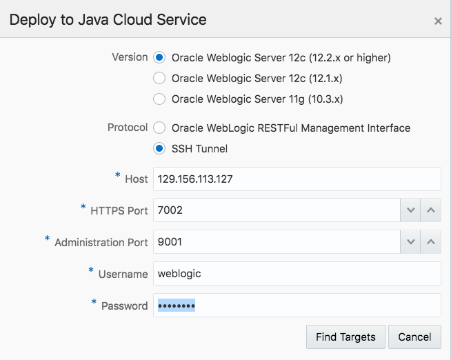

# CI/CD Demo - Café Supremo Microservices

This repository contains the demo script to demonstrate a typical DevOps workflow of a cloud native application using Oracle AppDev Platform. This includes services such as Oracle Developer Cloud Service, Java Cloud Service, Application Container Cloud Service and Database Cloud Service.

This demo will also show how to work with Open Source tools in Oracle Developer Cloud Service for managing your software lifecycle as well as how to build, deploy and promote to different environments. With Continuous Integration and Delivery as core principles, this demo will illustrate how issues are tracked, managed and how to manage releases.

This repository includes the instruction and pipeline definition for continuous delivery using Developer Cloud Service. On every pipeline execution, the code goes through the following steps:

This demo showcases the following:

*	Continuous Integration and Continuous Delivery through automation in Oracle Developer Cloud Service
*	Task creation using Oracle Developer Cloud Service Issue tracking system
*	Working with Open Source tools
*	Pushing the changes from a remote repository
*	Scaling up and scaling out of ACCS and JCS

# Time to Complete

Approximately 30 minutes

# Background

Oracle Developer Cloud Service is a cloud-based hosting environment for software development projects. It is available as a web interface accessible from a web browser. Oracle Developer Cloud Service provides the following features and services:

*	Project creation, configuration, and user management
*	Agile development
*	Integrated issue tracking for tasks, bugs, and enhancements
*	Source code repository through Git to store your application source
*	Maven repositories to store your application dependencies and libraries
*	Code Review enabled with Team Collaboration
*	Continuous software build integration
*	Wiki collaboration
*	Deployment to an Oracle Java Cloud Service and Application Container Cloud Service

# Scenario

You are an application developer who will be developing a brand new cloud native loyalty application for Café Supremo, which will be deployed to the Oracle Cloud. The reason why you want to adopt a cloud native approach has partially been driven by the need to go to market quicker, by delivering new features more frequently, but also more reliably. And you are able to do this by developing Microservices that has less dependencies on other services, as well as the footprint being smaller and easier to deploy. What’s also attractive with Microservices is that you can use the best programming language for the job. So, you could end up with a polyglot application. To be able to deliver this new style of cloud native application approach, you will need to adopt the Agile development practice to continuously integrate and deliver these services and features. The application basically consists of two parts:

1. The user interface that is built using Oracle JET framework, packaged as a WAR file and deployed to a Java Cloud Service instance
2. The Reward Collection backend service, which is a Microservice written in node.js, packaged as a ZIP file and deployed to an Application Container Cloud Service instance

You will use DevCS as the core CI/CD software lifecycle management tool for your Agile development and DevOps pipeline. The Café Supremo project has already been created and populated with both the JET UI and the Reward Service. The latest JET UI is also deployed to a previously provisioned JCS instance and the Reward Collection is deployed to a previously provisioned ACCS instance. The customer data has also been uploaded to a DBCS instance.
This demo assumes that you will be logging into an Oracle Developer Cloud Service instance that is populated with the Café Supremo project. This demo also requires a desktop environment with Brackets installed.

A project manager will be logging in to an Oracle Developer Cloud Service and manage the Café Supremo project from issue tracking to tracking the build, deploy and release progress.

# What Do You Need?

*	Access to an Oracle Developer Cloud Service instance
*	Access to an Oracle Application Cloud Service instance
*	Access to an Oracle Java Cloud Service instance
*	Access to a mobile phone
*	One of the following supported browsers:
    *	Firefox 31 or above
    *	Chrome 37 (also for Android)
    *	Safari 7, 8 or 9
    *	Safari Mobile 5 (iOS)
*	An installation of Brackets with Bracket Git by Martin Zagora extension installed
*	An installation to mirror your mobile screen to the projector
*	Some familiarity with Oracle Java Cloud Service
*	Some familiarity with Oracle Application Cloud Service
*	Some familiarity with Brackets
*	Some familiarity with the Git source control system
*	Some familiarity with Hudson Continuous Integration system

# Iteration 1:   Introducing the Café Supremo Loyalty Application and Oracle Cloud

You are an application developer who will be developing a brand new cloud native loyalty application for Café Supremo, which will be deployed to the Oracle Cloud.

# Step 1

Introduce the application. The application basically consists of two parts:

* The user interface that is built using Oracle JET framework, packaged as a WAR file and deployed to a Java Cloud Service instance
* The Reward Service is a Microservice written in node.js, packaged as a ZIP file and deployed to an Application Container Cloud Service instance

The JET UI and the Reward Service are being developed in parallel independent of each other, by two different teams.

* Mirror your mobile phone
* Enter Café Supremo URL - http://xxx.xxx.xxx.xxx/cafesupremo
* Click on the Menu icon

# Step 2

* Show how this JET UI looks like by going into the Discover and Stores options
* Highlight that the Rewards Service option has not been completed and hence it is greyed out
* The Reward Service is being implemented as a Microservice in Node.js
* Since the two services are implemented separately, using different languages and tools, there is very little integration and collaboration between the two teams
* Code are stored in separate Git repositories and they are built differently, but manually.
* We will show how you can improve your team’s productivity and quickly rollout new services by adopting CI/CD in Oracle AppDev Platform

* Click on each option to show what they do and highlight the Reward Service option is greyed as it has not be completed

# Step 3

* Here you are going to be requested to enter the information needed to access your cloud account

* Enter your Identity Domain
* Click GO
* Login with the credentials
* Enter your Password
* Click Sign In

# Step 4

* At a high level describe the different services; DevCS for Agile and CI/CD, JCS for Java and JET UI, ACCS for polyglot Microservices
* Mention that DBCS, JCS and ACCS have already been provisioned
* Customer data has been uploaded to DBCS

# Working with Projects

Think of yourself as the project manager for the Café Supremo Reward application. And you need to bring your JETUI frontend application into our cloud environment. You can do this by bringing your development under the control of Developer Cloud. With the Developer Cloud, you can implement CI/CD and adopt the Agile methodology into your development.

# Step 5

* On the Welcome page, you will see a list of projects hosted in the DevCS
* Here you can create a new project by clicking New Project.

* Click “+ New Project”

# Step 6

* We will create a project for the Café Supremo and bring all the components into this project so that we can automate the build and deploy process

* Enter the project name “Cafe Supremo”
* Enter a description
* Click Next

# Step 7

* Select an Empty Project for now
* We will clone an external Git repository where the JET UI is currently stored.
* Project creation will start upon selecting Finish.

* Select “Empty Project”
* Click Next
* Click Finish

# Step 8

* Developer Cloud Service will provision all the tools required for supporting CICD
* These are open source tools, but out of the box
* For example, for managing code, we use Git, for build and deploy we use Hudson
* We also support Maven and Docker
* For team collaboration we have Wiki, and issue tracking we have Bugzilla

* Wait for the project provisioning completes

# Cloning the JET UI Git Repository

Since the development of the JET UI has started already and the source code is being version controlled in an external Git repository, we can bring this code under the control within Developer Cloud by cloning the external Git repository.

# Step 9

* We now have an empty project
* There is no initial repository so we need to either create an initial repository or clone from an existing one
* We will clone from an existing Git repo with the source code for JET UI

* Click on “+ New Repository”

# Step 10

* Let’s clone an existing CafeSupremo repo, which is currently hosted in a different project
* This repo can be external and accessible by the public in GitHub

* Enter “CafeSupremo” as the Git repo name
* Check on “Import existing repository” radio box
* Enter the external CafeSupremo Git repo URL
* Enter the credential for external repo

# Step 11

* Once completed, you will see the new CafeSupremo.git repository
* A new event will also be logged in the recent activities column
* Now let’s switch to the Build tab to create our first build job

* Click on Build tab

# Building the JET UI Application

Now that we have imported the source code for our JET UI frontend, we can start creating our CICD pipeline. So the first task in our CICD pipeline is to build the application. We can create a build job for this. And we want the build to be triggered automatically whenever there is a code change. The default CI engine that comes out of the box in DevCS is Hudson. The build process can be automated and deployed automatically to a designated JCS environment.

# Step 12

* Switch to Build tab and create a new job. There should be no build job initially

* Click on New Job

# Step 13

* Enter the build job name

* Enter “JETUI_Build” as the job name

# Step 14

* Configure the build job by specifying the Git repo to build from

* Click on Source Control tab
* Click on “Git” radio box
* Select “CafeSupremo.git” from the dropdown repositories
* Click on Add button to add branches
* Select “master” from the dropdown Branch Specifier
* Click on Trigger tab

# Step 15

* Enable automated build by setting the trigger to be based on code commit in the Git repo

* Check the “Based on SCM polling schedule” radio box
* Click on Environment tab

# Step 16

* Select the Node.js version use for npm install

* Click on “Use Node.JS version” radio box
* Select “Node.JS v6.10.0” from the Use Node.JS version dropdown box
* Click on Build Steps tab

# Step 17

* Define the build steps as a shell script and enter the npm install command and zip to archive the app into a .war file for deployment

* Click on Add Build Step
* Select “Execute Shell” from dropdown list
* Copy and paste the npm install script into the command field
* Click on Post Build tab

# Step 18

* Define the location of the archive .war file for deployment

* Click on “Archive the artifacts” radio box
* Enter “target/cafesupremo.war” in the Files To Archive field
* Click on Save

# Step 19

* Let’s test the build job configuration by running a build now.
* Whilst we are waiting for the build to complete, which normally takes about 2 to 3 minutes, we can start configuring the deployment

* Click on Build Now
* Click on Issues tab

# Walkthrough DevCS Features

Whilst waiting for the build to complete, we can take a look round other DevCS features like Issue Tracking, Git, Branching, and Agile.

# Step 20

* Create a new issue

* Click on New Issues
* Click on Deploy tab

# Step 21

* The build should have started
* Check the progress of the build by going into the console
* Explain the log

* Click on JETUI_Build job
* Click on Console icon
* Click on Code tab

# Step 22

* Walkthrough the branching for bug fixes, new features and runtime builds
* Describe the need for branching

* Click on Logs tab
* Click on Graph View icon
* Click on Merge Requests tab

# Step 23

* Talk about merging branches and review by peers

* Click on New Merge Request

# Deploying the JET UI Application

# Step 24

* Create a new deployment for the JET UI to our previously provisioned JCS environment

* Click on New Configuration

# Step 25

* Define the deployment by specifying the name of the configuration, the application name, and target environment

* Enter “cafesupremo” in the Configuration Name field
* Enter “cafesupremo” in the Application Name field
* Click New Deployment Target
* Enter “129.156.113.127” in the Host field
* Click SSH Tunnel
* Enter “weblogic” and “welcome1” as the Username and Password
* Click Find Targets

# Step 26

* Select the cluster to deploy the JETUI app to

* Click on “demo_cluster” radio box
* Click OK

# Step 27

* Select the deployment build and automatic deployment

* Click on “Automatic” radio box
* Select the default from the dropdown options for Job, Build and Artifact
* Click Save and Deploy

# Step 28

* The deployment will take place immediately and should take only 20 seconds
* Highlight that we can create multiple deployments with different target environments
* The targets can for dev, test, UAT, pre-prod, and prod, etc.

* Go to Café Supremo URL - http://129.156.113.127/cafesupremo

# Step 29

* Verify the application was deployed successfully
* Point out IP address is the one we deployed to in our deployment script

* Switch back to the mobile phone
* Click through the screens

# Cloning the Git Repository to Brackets

To enable a developer to develop code and commit it to the Git repository in Developer Cloud, you can use your favourite IDE or a simple text editor with Git command line interface. However, we are going to strike a balance and use something that is pretty lightweight but has built in integration with Git. Brackets is an open source editor written in HTML, CSS, and JavaScript with a primary focus on web development. You can install a Git plug-in to integrate the commit and push process to Developer Cloud.

# Step 30

* Start by cloning the CafeSupremo.git repo from our project

* Open Brackets
* Select “Open Folder …”
* Change directory
* Click New Folder
* Enter “CafeSupremo”
* Click Open

# Step 31

* Start cloning the CafeSupremo.git from DevCS by providing the Git URL, and DevCS user credentials
* The cloning will take around 2 to 3 minutes depending on the speed of the network
* For the sake of time, I will let this continue whilst I go back to my project in Developer Cloud
* We will come back to this later to show how we commit and push code changes to the DevCS and start the CICD pipeline automatically

* Click Clone
* Switch back to DevCS
* Copy CafeSupremo.git URL
* Switch back to Brackets
* Paste URL into Git URL field https://cloud.admin@developer.us2.oraclecloud.com/developer78581-gse00014337/s/developer78581-gse00014337_cafesupremo_24888/scm/CafeSupremo.git
* Enter DevCS username and password
* Switch back to DevCS

# Integrating the Reward Service

As you saw with our JET UI, we had greyed the Reward option as the backend Reward microservice has not been completed. Just to show you how easy it is to develop and rollout new features in a cloud native application, a developer have been developing the Reward Service in Node.js in parallel to the JET UI. This Reward Service could be imported into another Developer Cloud Project and developed in isolation.

Once the service is ready, we can just bring it online. Unlike the traditional waterfall programming model where the whole application would have to be built and deployed as one monolithic application. We can build, deploy, test small pieces of code or microservices and release them independently.

Let’s see how we can automate the CICD process by making a code change in the local Git repository and pushing the change back to the Git repo in Developer Cloud. We know the Reward Service is being developed in parallel and they’re ready for integration. We have set a flag in our JETUI code to disable the Reward Service initially. Let me show you how I can enable this in the code and trigger the build and deployment automatically.

# Step 32

* The Git cloning should have completed by now
* And you should be in the cafesupremo folder
* Let’s enable the Reward Service by changing a flag in the JETUI
* Commit change to local clone repo

* Switch to Brackets
* Open src->js->appController.js
* Locate line 46
* Replace "true" with "false" on Rewards
* Save file
* Click Commit
* Enter commit message
* Click Git Push to push change back to DevCS

# Step 33

* Enter DevCS password to push changes to DevCS Git repo

* Click OK
* Switch back to DevCS project home

# Step 34

* Changes will be recorded in the project home
* Should see the build process started

* Click on the JETUI_Build job

# Step 35

* You can examine a running build by opening the build console
* So you will know exactly what the build is doing and how far it has gone

* Click on the Console icon next to the running build
* Click on Deploy tab

# Release, Promotion and Scaling

In a real world scenario where you need to continuously integrate and deploy your application to a test environment, you also need to promote it to the UAT and production environments. You can do this in DevCS by creating multiple deployment configuration for different environments. Release can also be managed and recorded in DevCS. With multiple releases, we also need a better way to manage our code. Branching is common practice in development for releasing multiple versions of an application
We can scale up or scale out of our JET UI application in JCS as well as the Rewards Microservice in ACCS.

# Step 36

* A release in DevCS is a collection of specific tags or branches of Git repositories, Maven repositories and binaries
* This allow you to create a release
* You can download the archive to be deployed manually on premise

* Click Releases

# Step 37

* There are 3 ways of scaling
   * Scale Up/Down – changing the Compute shape size
   * Scale Out – adding more nodes
   * Auto-Scaling – adding rule to increase or decrease WebLogic managed instances
   

* Go to the Dashboard
* Open the JCS Console

# Step 38

* Scaling up and down is even simpler with ACCS
* Let’s take a look at how we can do this for our Reward microservice
* Show how to scale up and scale out by increasing the memory and number of instances

* Go to the Dashboard
* Open the ACCS Console

# Step 39

* Check the build and deployment has completed
* It should say deployed just now

* Switch back to DevCS
* Go to Café Supremo URL - http://129.156.113.127/cafesupremo

# Step 40

* The Rewards option should now be visible
* Walkthrough the Rewards option by adding points and redeeming coffees

* Switch back to your mobile phone
* Click Rewards option

# End of Demo
